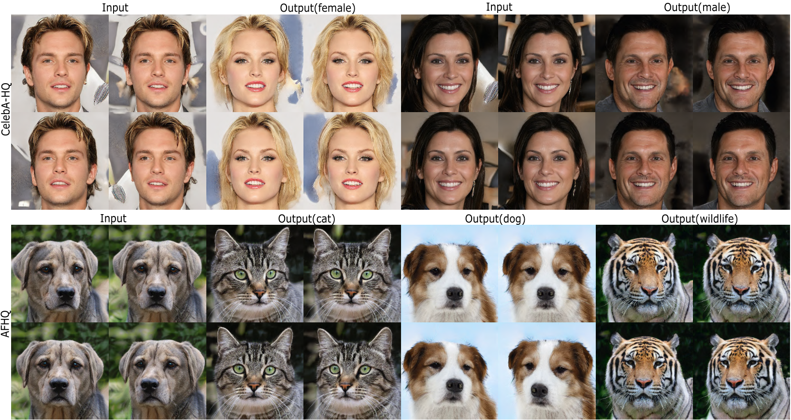

# 3DI2I: 3D-Aware Multi-Class Image-to-Image Translation with NeRFs</sub>



**3DI2I: 3D-Aware Multi-Class Image-to-Image Translation with NeRFs**<br>

Abstract: *Recent advances in 3D-aware generative models (3D-aware GANs) combined with Neural Radiance Fields (NeRF) have achieved impressive results for novel view synthesis. However no prior works investigate 3D-aware GANs for 3D consistent multi-class image-to-image (3D-aware I2I) translation. Naively using 2D-I2I translation methods suffers from unrealistic shape/identity change. To perform 3D-aware multi-class I2I translation, we decouple this learning process into a multi-class 3D-aware GAN step and a 3D-aware I2I translation step.   In the first step, we propose two novel techniques: a new conditional architecture and a effective training strategy.  In the second step, based on the well-trained multi-class 3D-aware GAN architecture that preserves view-consistency,  we construct a 3D-aware I2I translation system. To further reduce the view-consistency problems, we propose several new techniques, including a U-net-like adaptor network design, a hierarchical representation constrain and a relative regularization loss.   In extensive experiments on two datasets, quantitative and qualitative results demonstrate  that we successfully perform  3D-aware I2I translation  with  multi-view  consistency.*

## Requirements
The codebase is tested on 
* Python 3.8
* PyTorch 1.7.0
* 2× Quadro RTX 3090 GPUs (24 GB VRAM) with CUDA version 11.7

For additional python libraries, please install by:

```
pip install -r requirements.txt
```

## Datasets
Preparing datasets following [stylegan2-ada-pytorch](https://github.com/NVlabs/stylegan2-ada-pytorch#preparing-datasets) for 3D-aware I2I translation.

**1. dataset for unconditional stylenerf:**
```
python apps/dataset_tool.py --source=~/data/afhq/train/ --dest=~/datasets/afhq.zip
```
```
python apps/dataset_tool.py --source=~/data/celeba_hq/train/ --dest=~/datasets/celeba_hq.zip
```


**2. dataset for conditional stylenerf**

2.1. create labels for afhq and celeba-hq datasets. 
```
python apps/dataset_labels.py --out=~/data/afhq/train/dataset.json --source=~/data/afhq/train/
```
```
python apps/dataset_labels.py --out=~/data/celeba_hq/train/dataset.json --source=~/data/celeba_hq/train/
```

2.2. create dataset with lables (dataset.json) for afhq and celeba-hq.
```
python apps/dataset_tool.py --source=~/data/afhq/train/ --dest=~/datasets/afhq3c_labels.zip
```
```
python apps/dataset_tool.py --source=~/data/celeba_hq/train/ --dest=~/datasets/celeba2c_labels.zip
```

## Training
**1. unconditional 3D-aware generative model (using [StyleNeRF](https://github.com/facebookresearch/StyleNeRF) with stylenerf_afhq.yaml).**

finetune using mixed afhq(cat, dog and wild) datasets and ffhq_256.pkl pretrained model (unconditional stylenerf).
```
python run_train.py outdir=./output data=~/datasets/afhq.zip spec=paper256 model=stylenerf_afhq  resume='ffhq256' cond=False
```
finetune using mixed celeba-hq(female and male) datasets and ffhq_256.pkl pretrained model (unconditional stylenerf).
```
python run_train.py outdir=./output data=~/datasets/celeba_hq.zip spec=paper256 model=stylenerf_afhq  resume='ffhq256' cond=False
```

**2. conditional 3D-aware generative model**

**3. 3D-aware I2I translation**


## Rendering 3D-aware I2I translation results using the pretrained model
```bash
python generate.py --outdir=${OUTDIR} --trunc=0.7 --seeds=${SEEDS} --network=${CHECKPOINT_PATH} --render-program="rotation_camera"
```
It supports different rotation trajectories for rendering new videos.


